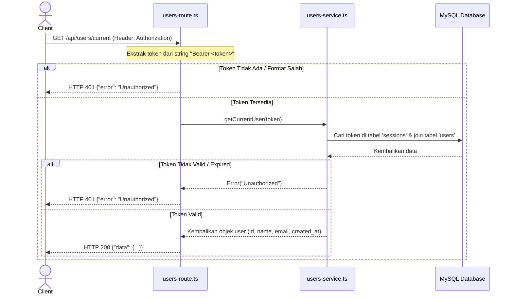

# Issue: Implementasi API Get Current User

## Deskripsi
Implementasikan fitur untuk mengambil data profil user yang sedang login (terautentikasi) menggunakan **ElysiaJS**, **Drizzle ORM**, dan **Bun**. Endpoint ini akan memvalidasi token yang dikirimkan melalui header `Authorization: Bearer <token>` terhadap tabel `sessions`, lalu mengambil data dari tabel `users`.

---

## 🏗️ Struktur Folder & File Terkait
Gunakan struktur modular yang sudah ada:
```text
src/
├── routes/
│   └── users-route.ts       <-- Modifikasi (Tambahkan route GET /current)
├── services/
│   └── users-service.ts     <-- Modifikasi (Tambahkan fungsi getCurrentUser)
└── index.ts
```

---

## 📋 Detail Spesifikasi

### 1. API Endpoint Get Current User
- **Method**: `GET`
- **Path**: `/api/users/current`
- **Headers**:
  - `Authorization: Bearer <token>` *(Catatan: Token dicocokkan dengan yang ada di tabel `sessions`, yang bereferensi ke `users` via `user_id`)*
- **Response Sukses (HTTP 200)**:
  ```json
  { 
    "data": {Buatkan issue.md yang berisi perencanan untuk nanti di implementasikan oleh junior proggramer atau ai model yang lebih murah isi dari perencanaan nya sebagai berikut: 

 buatkan API untuk get users saat ini yang sedang login

 Endpoint : GET /api/users/current

Headers :
Autorization: Bearer <token> (token adalah yang ada di table users)


 Response Body (Success);
 { 
    "data" : {
       "id" : 1,
       "name" : "Beju",
       "email" : "[Bejukuda@gmail.com]",
       "created_at" : "2022-01-01 00:00:00"
    } 
 }

 Response Body (Error) ;
 {
    "error" : "Unauthorized"
 }

Srruktur Folder di dalam src 
_roustes ; ini berisi routing elysia js
 - service ; ini berisi logic bisnis aplikasi
 
 Strurktur file
 - routes : menggunakan format misal users-route.ts
 - service : menggunakan format misal users-service.ts
 Jelaskan tahapan-tahapan yang harus di lakukan untuk mengimplementasikan adalah junior proggramer atau model AI yang lebih murah
       "id": 1,
       "name": "Beju",
       "email": "bejukuda@gmail.com",
       "created_at": "2022-01-01 00:00:00"
    } 
  }
  ```
- **Response Error (HTTP 401)**:
  ```json
  {
    "error": "Unauthorized"
  }
  ```

---

## 🗺️ Alur Data (Flowchart)



---

## 🛠️ Tahapan Implementasi (Step-by-Step) untuk Junior / AI

### Langkah 1: Modifikasi Service Layer (`src/services/users-service.ts`)
1. Buka file `src/services/users-service.ts`.
2. Tambahkan metode statis baru `getCurrentUser(token: string)`.
3. Gunakan Drizzle untuk melakukan *inner join* antara tabel `sessions` dan tabel `users` berdasarkan `token`:
   ```typescript
   const [result] = await db
     .select({
       id: users.id,
       name: users.name,
       email: users.email,
       created_at: users.createdAt
     })
     .from(sessions)
     .innerJoin(users, eq(sessions.userId, users.id))
     .where(eq(sessions.token, token))
     .limit(1);
   ```
4. Periksa apakah `result` ditemukan.
   - Jika `!result`, lemparkan error: `new Error('Unauthorized')`.
   - Jika ditemukan, kembalikan objek `result` tersebut.

### Langkah 2: Modifikasi Route Layer (`src/routes/users-route.ts`)
1. Buka file `src/routes/users-route.ts`.
2. Di dalam instance Elysia `usersRoute`, tambahkan rute `.get('/current', ...)` (yang akan menjadi `/api/users/current`).
3. Di parameter handler, akses `headers` dan `set` objek dari Elysia: `async ({ headers, set }) => { ... }`.
4. Ekstrak header `authorization`. Lakukan validasi dasar:
   - Jika header kosong atau tidak diawali dengan `"Bearer "`, tangani dengan:
     ```typescript
     set.status = 401;
     return { error: 'Unauthorized' };
     ```
   - Jika ada, pisahkan string tersebut untuk mendapatkan token mentah:
     ```typescript
     const token = headers.authorization.split(' ')[1];
     ```
5. Bungkus pemanggilan `UsersService.getCurrentUser(token)` di dalam `try-catch`.
   - Jika catch menangkap pesan `'Unauthorized'`, set status ke `401` dan return `{ error: "Unauthorized" }`.
   - Jika sukses, return data: `{ data: user }`.

### Langkah 3: Pengujian
Uji endpoint dengan token yang didapat dari API login sebelumnya:
```bash
curl -X GET http://localhost:3000/api/users/current \
  -H "Authorization: Bearer <GANTI_DENGAN_TOKEN_ANDA>"
```
Pastikan merespons dengan data user ketika token benar, dan merespons dengan pesan `Unauthorized` saat token salah.
