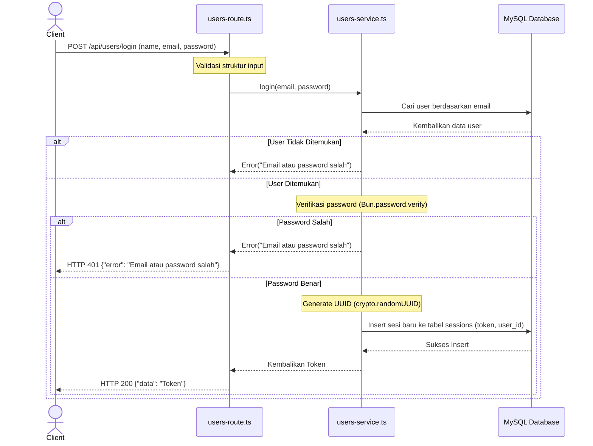

# Issue: Implementasi Fitur Login User & Manajemen Sesi

## Deskripsi
Implementasikan fitur login user dan pembuatan sesi menggunakan **ElysiaJS**, **Drizzle ORM** (dengan MySQL), dan **Bun**. Fitur ini merupakan kelanjutan dari sistem registrasi sebelumnya, dengan struktur kode modular yang terbagi dalam layer Routing (`routes`) dan Business Logic (`services`).

---

## 🏗️ Struktur Folder & File Terkait
Gunakan struktur modular yang sudah ada:
```text
src/
├── db/
│   ├── index.ts
│   └── schema.ts            <-- Modifikasi (Tambahkan tabel sessions)
├── routes/
│   └── users-route.ts       <-- Modifikasi (Tambahkan route POST /login)
├── services/
│   └── users-service.ts     <-- Modifikasi (Tambahkan fungsi login)
└── index.ts
```

---

## 📋 Detail Spesifikasi

### 1. Skema Database (`sessions` table)
Tambahkan tabel `sessions` pada file `src/db/schema.ts` dengan struktur berikut:
- **`id`**: `serial` (integer auto increment, Primary Key)
- **`token`**: `varchar(255)` (not null, berisi UUID untuk otentikasi user)
- **`user_id`**: `int` (Foreign Key mengarah ke kolom `id` di tabel `users`)
- **`created_at`**: `timestamp` (default `current_timestamp` / `defaultNow()`)

### 2. API Endpoint Login
- **Method**: `POST`
- **Path**: `/api/users/login`
- **Request Body**:
  ```json
  {
     "name": "Beju",
     "email": "bejukuda@gmail.com",
     "password": "BEJUKUDA"
  }
  ```
  *(Catatan: Meskipun umumnya login hanya butuh email & password, tetap ikuti kontrak payload dari frontend di atas jika diminta)*
- **Response Sukses (HTTP 200)**:
  ```json
  {
     "data": "a3b8...-uuid-token"
  }
  ```
- **Response Error (HTTP 401 / 400)**:
  ```json
  {
     "error": "Email atau password salah"
  }
  ```

---

## 🗺️ Alur Data (Flowchart)
Berikut adalah visualisasi alur login dari request hingga respons:



---

## 🛠️ Tahapan Implementasi (Step-by-Step) untuk Junior / AI

### Langkah 1: Update Skema Database
1. Buka file `src/db/schema.ts`.
2. Impor `int` (jika menggunakan MySQL) dari `drizzle-orm/mysql-core`.
3. Definisikan tabel baru `sessions`:
   ```typescript
   export const sessions = mysqlTable('sessions', {
     id: serial('id').primaryKey(),
     token: varchar('token', { length: 255 }).notNull(),
     userId: int('user_id').references(() => users.id).notNull(),
     createdAt: timestamp('created_at').defaultNow(),
   });
   ```

### Langkah 2: Buat & Jalankan Migrasi Database
1. Buka terminal dan jalankan perintah generate migrasi:
   ```bash
   bun db:generate
   ```
2. Jalankan perintah migrasi untuk memperbarui database:
   ```bash
   bun db:migrate
   ```

### Langkah 3: Modifikasi Service Layer (`src/services/users-service.ts`)
1. Buka file `src/services/users-service.ts`.
2. Tambahkan metode statis baru `login(email: string, password: string)`.
3. Gunakan Drizzle untuk mencari user: `db.select().from(users).where(eq(users.email, email)).limit(1)`.
4. Jika array kosong (user tidak ada), lempar error: `new Error('Email atau password salah')`.
5. Jika ada, verifikasi password menggunakan **Bun native hashing**: 
   `const isMatch = await Bun.password.verify(password, user.password);`
6. Jika `!isMatch`, lempar error yang sama: `new Error('Email atau password salah')`.
7. Jika benar, buat token UUID dengan fungsi bawaan JS: `const token = crypto.randomUUID();`
8. Insert token tersebut ke tabel `sessions`: `await db.insert(sessions).values({ token, userId: user.id });`
9. Return token.

### Langkah 4: Modifikasi Route Layer (`src/routes/users-route.ts`)
1. Buka file `src/routes/users-route.ts`.
2. Di dalam instance Elysia yang sudah ada, tambahkan rute `post('/login', ...)` (path jadinya `/api/users/login`).
3. Buat schema validasi body menggunakan `t.Object` untuk menerima `name`, `email`, dan `password` sesuai kontrak.
4. Di dalam handler, panggil `UsersService.login(body.email, body.password)`.
5. Bungkus dalam `try-catch`. 
   - Jika catch error `Email atau password salah`, return status `401` dengan JSON `{ "error": "Email atau password salah" }`.
   - Jika berhasil, return JSON `{ "data": token }`.

### Langkah 5: Pengujian
Gunakan cURL atau HTTP Client:
```bash
curl -X POST http://localhost:3000/api/users/login \
  -H "Content-Type: application/json" \
  -d '{
    "name": "Beju",
    "email": "bejukuda@gmail.com",
    "password": "BEJUKUDA"
  }'
```
Pastikan merespons token yang valid dan sukses tersimpan di database.
